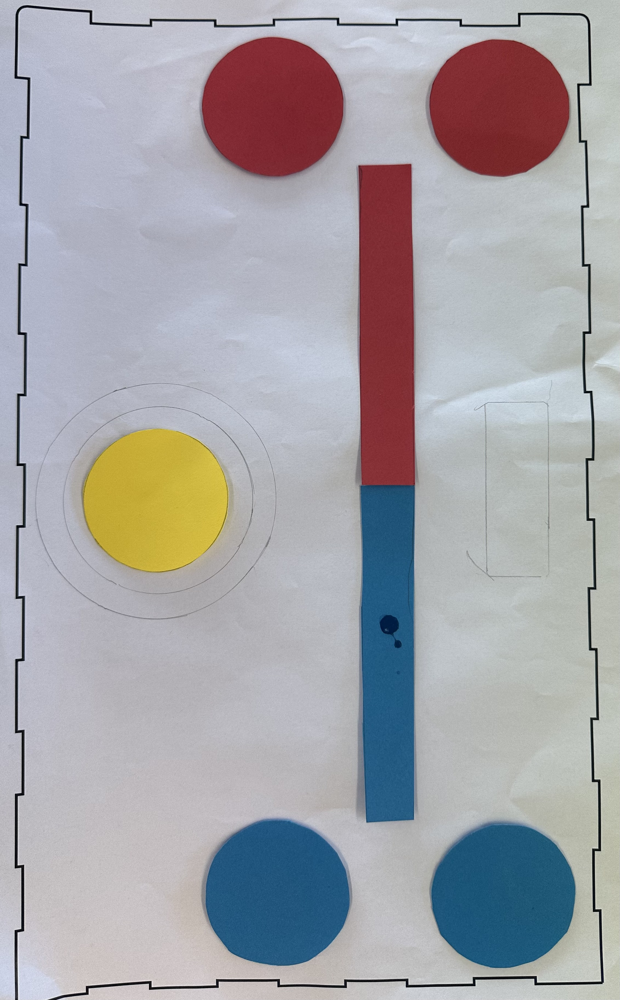
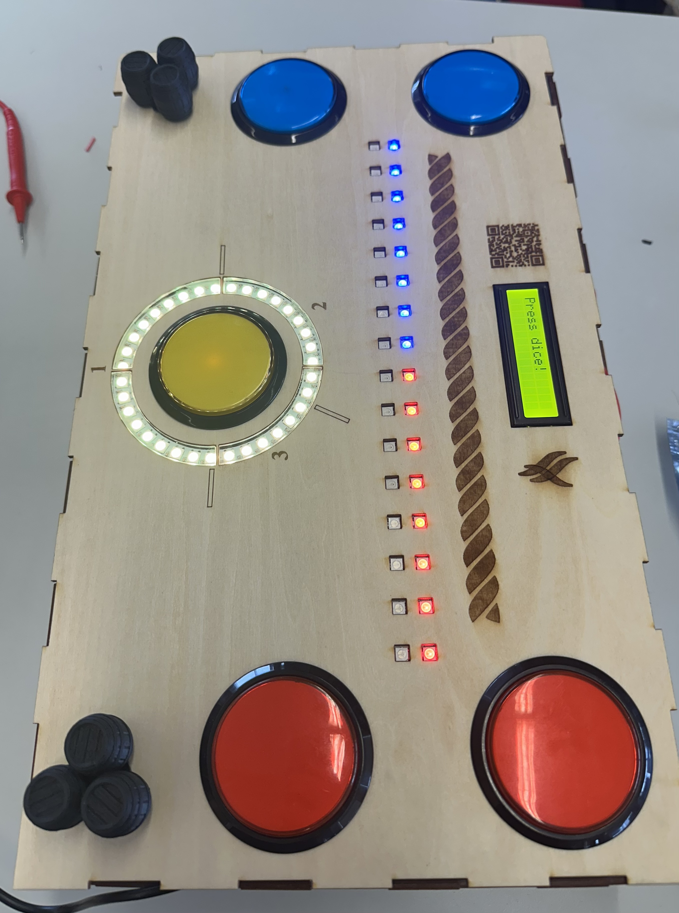
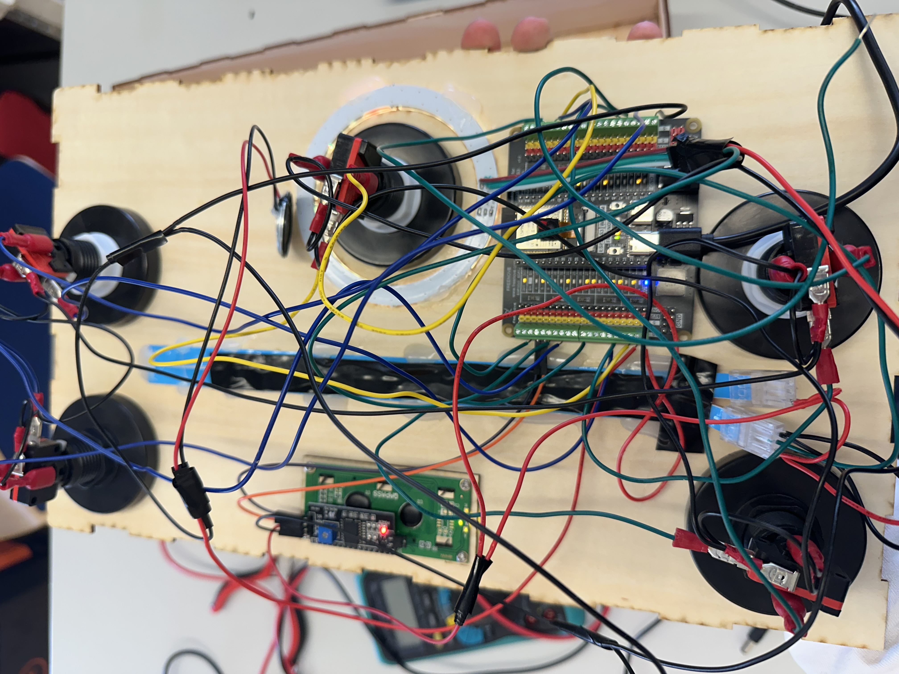
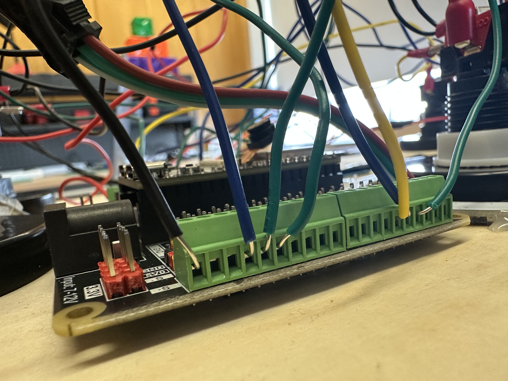

# Verkefni4-VESM1VS05AU
Lokaverkefni VESM1VS05AU, reypitog.
Tristan Víðisson og Logi Sólborgarsson.

# Hugmynd
Verkefnið okkar var reypitogs borðspil þar sem tvö lið keppa sín á milli með viðbrögðum og heppni.

Leikurinn notar:
* ESP32-S3
* MicroPython
* NeoPixel LED ljós
* Arcade takka
* LCD skjá
* Buzzer/hátalara
* Rafhlöðu

---

# Spilareglur !!!
Tveir leikmenn keppa hvor á móti öðrum. 
Í hverri umferð kviknar handahófskennt á einum takka hjá báðum leikmönnum. Fyrsti leikmaðurinn sem ýtir á sinn upplýsta takka vinnur umferðina og fær að kasta teningnum með því að ýta á gula teningstakkann. 
Teningururinn stoppar á 1, 2 eða 3 stigum. Fjöldi stiga ákveður hversu mikið reipið færist í átt frá sigurvegara umferðarinnar.

1 stig hefur 50% líkur á að fá
2 stig hefur 30% líkur á að fá
3 stig hefur 20% líkur á að fá

Leikurinn endar þegar annað liðið hefur ýtt reipinu alla leið yfir á hina hliðinna og allt LED stripið er orðið í þeirra lit.

---

# Forritun 
Leikurinn var forritaður í Thonny, MicroPython.
* [`main.py`](main.py)

---

# Hönnun
Borðspilið var hannað í Inkscape fyrir laserskurð og Tinkercad fyrir 3D prent.

# Myndir

## Pappírsfrumgerð

## Borðspilið

## Lóðun og rafrás

---

# Myndband
[Myndband af leiknum](LINKUR-HÉR)

---

# Hönnunarskrár 📁
* [SVG skrá](Bordspil_reypitog.svg)
* [STL leikmunir](tunnur.stl)
